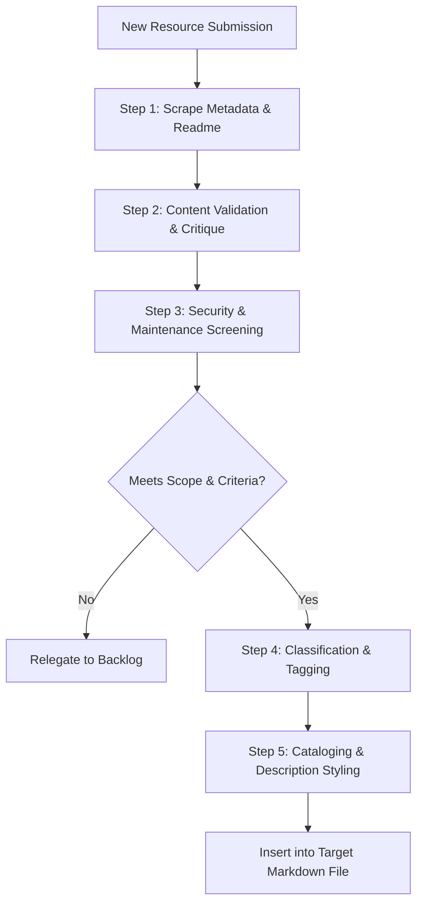

# Computational Materials Science Knowledge Management Workflow

This skill defines a guidelines-based workflow intended to assist in curating, validating, and cataloging computational materials science (CMS) resources. It aims to evaluate if indexed resources are scientifically relevant, active, secure, and consistently categorized.

## 1. Overview
Knowledge Management Workflow (KMW) in CMS involves indexing and organizing software packages, workflow managers, datasets, machine learning models and potentials (MLIPs), simulation platforms, utility tools, databases, curated lists, and educational resources. A key objective is to maintain a high-quality, comprehensive repository of resources for the scientific community, aiming to support diverse computational materials informatics, modeling, and simulation tasks.

## 2. Core Curation Workflow



### Step 1: Metadata & Readme Retrieval (Use [fetch_metadata.py](./scripts/fetch_metadata.py))
- Scrape or query repository API (e.g., GitHub, Gitee) to retrieve description, license, active branches, and commit history.
- Retrieve the repository's `README.md` to extract technical functionality and developer intent.

### Step 2: Content Validation & Scientific Critique (Use [check_scientific_rigor.py](./scripts/check_scientific_rigor.py))
- **Functional Accuracy:** Verify that the catalog description matches actual code functionality.
- **Scientific Rigor:** Evaluate the tool's peer review standing (e.g., associated journal papers, citations).
- **Reproducibility:** Check if standard methods or protocols are clearly defined.
- **Community Standing:** Assess usage within the niche community (e.g., DFT, molecular dynamics, machine learning informatics).

### Step 3: Security & Maintenance Screening (Use [check_security_maintenance.py](./scripts/check_security_maintenance.py))
- **Domain Verification:** Verify that links point to recognized domains (such as GitHub, GitLab, Gitee, Zenodo, or established university/consortium sites).
- **Maintenance Activity:** Check for recent commits or active issue tracking to avoid "abandonware."
- **Licensing:** Prioritize resources with standard open-source licenses (MIT, Apache 2.0, BSD, GPL). Explicitly label commercial platforms.

### Step 4: Classification & Structural Placement (Use [classify_resource.py](./scripts/classify_resource.py))
Determine the file target based on architectural purpose:
1. **Simulation Bundles vs. Process Managers:**
   - **Bundles & Solvers (`sim-multiscale-multiphysics.md`):** If the resource bundles multiple physical calculation packages/solvers (DFT, MD, MC, thermal solvers) or couples physical scales concurrently (QM/MM, PIMD), catalog it in `docs/sim-multiscale-multiphysics.md`. Add the `Code/Sim` tag.
   - **Process & Workflow Managers (`wf-toolkits.md`):** If the resource only orchestrates execution, pipelines, or database access without bundling its own solvers (e.g., AiiDA, pyiron, Rescale), catalog it in `docs/wf-toolkits.md`. Add the `Code/WF` tag.
2. **Machine Learning Toolkits (`ml-toolkits.md`):** If the tool is a developer framework or utility for machine learning in chemistry/materials (e.g., training pipelines, tensor operations), place it in `docs/ml-toolkits.md`. Add the `Code/ML` tag.
3. **Out-of-Scope Backlog (`backlog.md`):** If the tool is general-purpose (e.g., general PDE/physics solvers, non-materials specific agents) or a static research database publication record (Zenodo, Figshare), catalog it in `docs/backlog.md`.

### Step 5: Cataloging & Description Styling (Use [format_catalog_entry.py](./scripts/format_catalog_entry.py))
Adhere to the following stylistic guidelines when formatting entries:
*   **Objectivity:** Avoid qualitative marketing adjectives (e.g., "state-of-the-art", "highly efficient", "advanced").
*   **Redundancy Removal:** Avoid introductory packaging prefixes (e.g., "A Python package for...", "Code for...", "Official implementation of..."). Start directly with the core action or function.
*   **No License Info in Text:** Exclude license types from the description string, as users have to check the license accordingly.
*   **Sentence Case:** Capitalize only the first character of the description sentence (excluding proper nouns, acronyms, or math terms like `SE(3)`, `DFT`, `XANES`).
*   **Commercial Labeling:** Append `(commercial)` at the end of the description if the platform serves commercial/proprietary purposes.

---

## 3. Reference Table Format
Entries must be formatted as rows in Markdown tables:
```markdown
| Item (URL) | Description | Tags |
| :--------- | :---------- | :--- |
| [Name](URL) | Directly states the primary function in sentence case. (commercial) | Tag1, Tag2 |
```

---

## 4. Standard Tag Taxonomy
Assign tags strictly from the repository glossary:
*   `List`: Curated compilations
*   `Data`: General data & metadata registries
*   `Data/Exp`: Experimental datasets
*   `Data/Comp`: Theoretically calculated structures/properties
*   `Code/Lib`: Pre-processing, post-processing, and utility libraries
*   `Code/Sim`: Solvers and simulation engines
*   `Code/WF`: Workflow managers and pipeline orchestrators
*   `Code/ML`: Machine learning architectures, models, and MLIPs
*   `App`: Web services and graphical application portals
*   `Edu`: Tutorials and educational open courseware

---

## 5. Helper Scripts
This skill is supported by the following automation scripts located in the [scripts/](./scripts) directory:
- [fetch_metadata.py](./scripts/fetch_metadata.py): Automates Step 1 by fetching repository description, license, last update date, and readme file contents using GitHub/Gitee APIs.
- [check_scientific_rigor.py](./scripts/check_scientific_rigor.py): Automates Step 2 by analyzing readme texts for citations, DOIs, arXiv numbers, BibTeX entries, reproducibility setups, and scientific keywords.
- [check_security_maintenance.py](./scripts/check_security_maintenance.py): Automates Step 3 by checking domain trust lists, performing live URL checks, verifying open-source licenses, checking archived states, and calculating update intervals.
- [classify_resource.py](./scripts/classify_resource.py): Automates Step 4 by matching keyword heuristics to determine target categories, target markdown files, and standard tags.
- [format_catalog_entry.py](./scripts/format_catalog_entry.py): Automates Step 5 by removing description redundancies, enforcing sentence case (while preserving scientific terms), detecting commercial features, and outputting formatted markdown table rows.

---

## 6. Example Execution Prompts
Here are examples of how a user triggers this workflow:

- *"Add the repository https://github.com/dralgroup/mlatom to the collection, verifying its scope and classification."*
- *"We need to add a new conversational agent platform Rescale. Can you evaluate it under the CMS knowledge management workflow?"*
- *"Format the description of ASAP to match the repository styling rules."*

